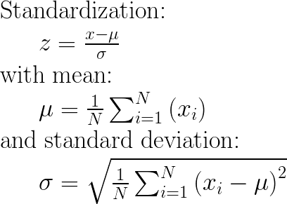
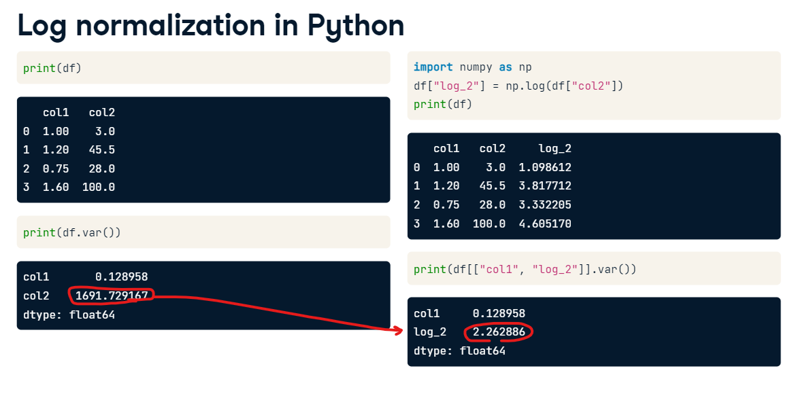

## Why Scaling?
Scaling is an important **preprocessing step** in machine learning that involves transforming input features to a standardized range or distribution. There are several reasons why scaling is important:
 1. ### Improved performance of some machine learning algorithms:
 Many machine learning algorithms, such as k-nearest neighbors, support vector machines, and neural networks, are based on `**distance calculations**` between data points. If the features are not scaled, features with larger values may dominate the distance calculations, leading to biased results. Scaling the features to a similar range can help prevent this problem and improve the performance of these algorithms.

 2. ### Faster convergence of some optimization algorithms:
 
  Optimization algorithms, such as gradient descent, are often used in machine learning to minimize a loss function. If the features are not scaled, the optimization algorithm may take longer to converge, leading to longer training times. Scaling the features can help ensure that the optimization algorithm converges faster.

  3. ## Improved interpretability of some models: 
  Some machine learning models, such as linear regression and logistic regression, are based on coefficients that are learned from the input features. If the features are not scaled, the coefficients may not be directly comparable, making it difficult to interpret their relative importance. Scaling the features can help ensure that the coefficients are comparable and interpretable.


## Types of Scaling
- MinMaxScaler: *< from sklearn.preprocessing import MinMaxScaler >*
- StandardScaler:  *< from sklearn.preprocessing import StandardScaler >*
- Log normalization : *< numpy.log >*

> The choice of scaling method depends on the nature of your data and the specific problem you are trying to solve.
## MinMaxScaler (data between 0 and 1)
For each value in a feature, MinMaxScaler subtracts the minimum value in the feature and then divides by the range. The range is the difference between the original maximum and original minimum. MinMaxScaler preserves the shape of the original distribution.
### Coding
``` python
from sklearn.preprocessing import MinMaxScaler
import pandas as pd

# create example dataframe
df = pd.DataFrame({'col1': [1, 2, 3, 4, 5], 'col2': [100, 200, 300, 400, 500]})

# create scaler object
scaler = MinMaxScaler()

# fit and transform the dataframe
scaled_df = pd.DataFrame(scaler.fit_transform(df), columns=df.columns)

print(scaled_df)
```
In this example, the MinMaxScaler scales each column in the dataframe to a range between 0 and 1. The fit_transform() method fits the scaler to the data and then applies the scaling transformation. The resulting scaled dataframe is stored in scaled_df.

### output
```
   col1  col2
0   0.0   0.0
1   0.25  0.25
2   0.5   0.5
3   0.75  0.75
4   1.0   1.0
```


## StandardScaler (mean 0 and variance 1)
StandardScaler() will normalize the features i.e. each column of X, INDIVIDUALLY, so that each column/feature/variable will have μ = 0 and σ = 1.



### Coding
``` python
from sklearn.preprocessing import StandardScaler
import pandas as pd

# create example dataframe
df = pd.DataFrame({'col1': [1, 2, 3, 4, 5], 'col2': [100, 200, 300, 400, 500]})

# create scaler object
scaler = StandardScaler()

# fit and transform the dataframe
scaled_df = pd.DataFrame(scaler.fit_transform(df), columns=df.columns)

print(scaled_df)

```
### output
```
       col1      col2
0 -1.264911 -1.264911
1 -0.632456 -0.632456
2  0.000000  0.000000
3  0.632456  0.632456
4  1.264911  1.264911
```

In this example, the StandardScaler standardizes each column in the dataframe to have mean 0 and variance 1. The fit_transform() method fits the scaler to the data and then applies the standardization transformation. The resulting standardized dataframe is stored in scaled_df.

## MinMaxscaler vs. StandardScaler
The MinMaxscaler is a type of scaler that scales the minimum and maximum values to be 0 and 1 respectively. While the StandardScaler scales all values between min and max so that they fall within a range from min to max.Jul 27, 2020

---------------
## Log Normalization
- Useful for features with high variance. It reduces variance in the column and make it comparable to other columns in the model
- Applies logarithm transformation which approximates normality
- Takes the ***natural log*** of each number using the constant e(~2.718)
- It captures relative changes, the magnitude of change, and keeps everything positive

### Coding




> :memo: **Note:** you can use different scaling methods for different dimensions (i.e., columns) of your data. In fact, it's quite common to use different scaling methods for different features in a dataset. It's important to choose the appropriate scaling method for each feature in your dataset based on the nature of the data and the problem you are trying to solve.

> :memo: **Note:** However, keep in mind that applying different scaling methods to different features may impact the relationships between the features, and may affect the performance of some machine learning algorithms that assume the data is scaled uniformly. So, it's important to carefully consider the consequences of applying different scaling methods to different features.

---------------------
## Algorithms that benefit from scaling:
Here are some examples :

### 1. k-Nearest Neighbors (KNN): 
KNN is a distance-based algorithm that calculates the distance between data points to make predictions. If the features are not scaled, features with larger scales may dominate the distance calculations, leading to biased results. Scaling the features can help ensure that all features contribute equally to the distance calculations and improve the performance of KNN.

### 2. Support Vector Machines (SVM): 
SVM is a **classification algorithm** that finds the hyperplane that best separates the data points in different classes. If the features are not scaled, features with larger scales may dominate the optimization of the hyperplane, leading to biased results. Scaling the features can help ensure that all features contribute equally to the optimization of the hyperplane and improve the performance of SVM.

### 3. Neural Networks:
 Neural networks are a powerful class of algorithms that can model complex non-linear relationships between features and targets. If the features are not scaled, the optimization of the neural network may take longer to converge, leading to longer training times. Scaling the features can help ensure that the optimization algorithm converges faster and improve the performance of neural networks.

### 4.Linear Regression: 
Linear regression is a regression algorithm that models the relationship between the input features and a continuous target variable. If the features are not scaled, the coefficients may not be directly comparable, making it difficult to interpret their relative importance. Scaling the features can help ensure that the coefficients are comparable and interpretable, and improve the performance of linear regression.

### 5. Principal Component Analysis (PCA): 
PCA is a technique used for dimensionality reduction and feature extraction. If the features are not scaled, features with larger scales may dominate the principal components, leading to biased results. Scaling the features can help ensure that all features contribute equally to the principal components and improve the performance of PCA.

-------------
## ML Algorythms not affected by Scaling
There are some machine learning algorithms that are not affected by feature scaling. These include:

### 1. Tree-based models: 
**Decision trees**, **random forests**, and gradient boosting models are not sensitive to feature scaling because they partition the data based on threshold values of individual features. Scaling does not affect the relative ordering of these values.

### 2. Naive Bayes:
 Naive Bayes is a probabilistic algorithm that assumes the features are conditionally independent given the target variable. Scaling does not change the conditional independence of the features.

### 3.Linear Discriminant Analysis (LDA):
 LDA is a classification algorithm that finds a linear combination of features that maximizes the separation between the classes. Since scaling only changes the scale and not the direction of the features, it does not affect the linear combination found by LDA.

:memo: **Note:** However, it is still a good practice to scale the features before fitting the model, even if the algorithm is not affected by scaling. This can help improve the stability and speed of the optimization algorithm and may still result in a better performance of the model.


