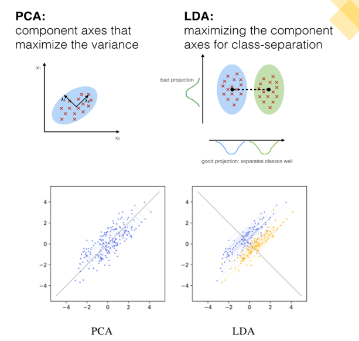
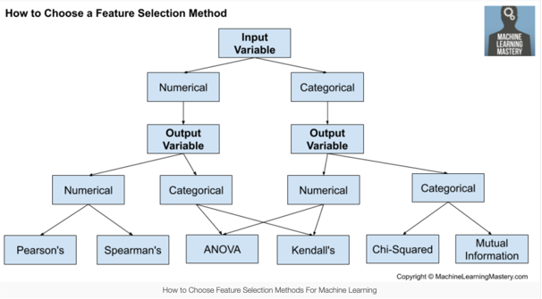

## Why Dimensionality Reduction

Dimensionality reduction (reducing the number of features) can result in:

- Visualizations (2-3 dimensional plots)
- Lower computational complexity (time and space)
- Improve model performance (e.g. accuracy)
- Avoid over-fitting
- mitigate the curse of dimensionality

> :memo: **Note:** The curse of dimensionality refers to a set of problems that arise when working with high-dimensional data. The curse of dimensionality basically means that the error increases with the increase in the number of features. It refers to the fact that algorithms are harder to design in high dimensions and often have a running time exponential in the dimensions. The dimension of a dataset corresponds to the number of attributes or features that exist in it.

## How can we reduce the number of features?

1. Dimensionality reduction (transform features into a lower dimension using linear algebra)
    - PCA: Principal Component Analysis
    - LDA

2. Variable selection (simply selecting or excluding certain variables)

    - Filter methods
    - Wrapper methods

## Feature Selection vs Dimensionality Reduction

1. PCA and LDA are dimensionality reduction techniques
2. Filter and Wrapper methods are variable selection techniques
### Dimensionality reduction:
 Creates new features that are functions of the original ones (for PCA/LDA, linear combinations of the original ones).

-   Less information lost
-   Less interpretability

#### Feature Selection: 
Removes redundant features and keeps important ones (no new features created).

-   More information lost
-   More interpretability
-----------
## What is PCA?
PCA represents many variables with fewer variables while minimizing loss of information!

For number of dimensions (variablse/features) in our data, we also have the same number of principal components.

> :bulb: **Tip:** Remember that PC1 was a “best-fit” line in the direction of MOST variation.

PC2 will be in the direction of the **next most variation**, following a few rules:
- Must pass through the mean of each variable
- Must be perpendicular/orthogonal to all other previous principal components.

We keep the principal components that have the most variation! 

PCA is done mathematically through matrix multiplication (python: sklearn)

> :memo: **Note:** it is important to scale data prior to PCA (since it’s based on variance). (StandardScaler)

## Coding
``` python
# Create cumulative explained variance graph
# Pretend we'd like to have about 90% explained variance
from sklearn.decomposition import PCA

pca = PCA()
pca.fit(df)

cum_explained_variance = np.cumsum(pca.explained_variance_ratio_)
plt.plot(cum_explained_variance)
plt.xlabel('PC number')
plt.ylabel('% Cumulative explained variance')
```
``` python
# Find the first 100 principle components of the dataset
pca = PCA(n_components=100)
pca.fit(df)

# Transform the data to its low-dimensional representation
reduced_df = pca.transform(df)

print(reduced_df.shape)
pd.DataFrame(reduced_df).head() #as a dataframe
```
-------------------------------

## What is LDA?
LDA is Linear Discriminant Analysis
.

> :bulb: **Tip:** Remember that LDA is for supervised ML and can only be done for classification/categorical target variable.

### PCA vs LDA

1. Both are dimensionality reduction techniques.
2. Both create new dimensions by using linear combinations of original dimensions to minimize losing information
3. PCA is most popular
4. PCA is unsupervised, LDA is supervised (categorical target variable)

5. PCA creates successive PCs in directions of MOST variance
6. LDA creates successive components that
    - Minimize “intra-class” variance
    - Maximize “inter-class” variance





------------

## Filter Methods

1. Give each feature a “score” that represents how “important” it is.

    Scores can be based on:

    - Correlation with target variable
    - High/low variance (imagin all data of a col is 1, so we delete that column)
    - Feature similarity (correlation between features)

2. Keep features with high scores, discard features with low scores.
3. This method is applied before training ML model

### Advantages: 
- Fast—no training involved, just calculations
### Disadvantages: 
- Can ignore feature combinations
- May keep redundant features


------------

## Wrapper Methods
Train model multiple times with different combinations of subsets of features.
Goal is to find the “best” subset of features.

### Advantages:

- Evaluates features in context of others
- Performance-driven

### Disadvantages:
Slow (must re-train model each time)

### Popular wrapper methods:

- Forward selection
- Backward selection
- Stepwise selection

## Wrapper VS filtering

- Filter methods are done before training (score each feature, keep best scores)
- Wrapper methods are done by re-training the model with different subsets (forward, backward, stepwise)

-----------------------------
## My Questions
- Why not using PCA for clustering before modeling? (It is mostly used before modeling. I need to ask Jeremy, why told so)
- Do we use PCA for classification before or after modeling?
- Should we [scale](./Scaling_data.md) all the features? How can we do it? ( yes we should, trough StandardScaler or MinMaxScaler)
- Should we deal with outliers prior to PCA? (Yes)
- Does the information loss in PCA, mean that we disregard some rows in the modeling? (No, columns or features are combined)
- How to identify the extreme cases where PCA is not useful and cause loosing lots of information? (I think with the variance graph)
- It seams that PCA deals with outliers in some way. Am I right? (No, PCA reduces the dimensionality without losing information from any features. )
