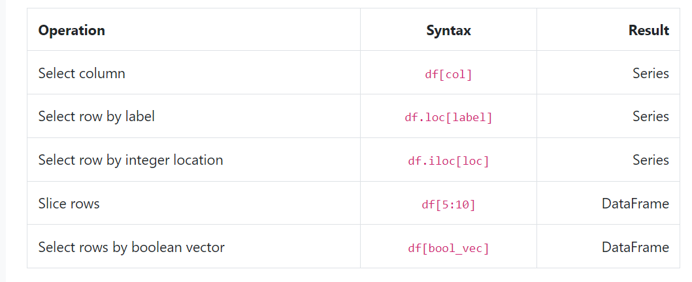

These notes are from [365datascience](https://learn.365datascience.com/courses/preview/data-cleaning-preprocessing-pandas/)


## 1. Methods: From Data
Although attributes are about matadata, Methods are about functionalities and behaviour of the object.
Different libraries have different methods. Methods manipulate object, thus each object have its own methods. For example, methods used for Series cannot be used for DataFrames and vise versa.
``` Python
x.sum()
x.max()
x.min()
x.idxmax()
x.idxmin()
x.head()
x.tail()
x.describe()
x.nunique()    # number of unique values in the Series
x.unique()   #Delivers the values in the order they have appeared in the data set. 
x.to_numpy()  #This code will convert the Series fully to the numpy array type!
x.sort_values() #Sorts in Ascending order
.copy() #copies the dataset
x.sort_values().head() #Method Changing
x.sort_index()
astype() #The astype() method is used to cast a Pandas object to a particular data type. It can be a very helpful function in case your data is not stored in the correct format (data type). For instance, if floating point numbers have somehow been misinterpreted by Python as strings, you can convert them back to floating point numbers with astype().
pd.read_csv()
astype()
to_datetime()
value_counts()
drop_duplicates()
groupby()
fillna()
merge()

```
For More information click on [this lesson from LHL](https://data.compass.lighthouselabs.ca/1feac02f-2b81-409d-9192-9705596ef731)

This method has been introduced to satissfy the increased demand for improved transformation of pandas Series to NumPy arrays.
```
- If we don't put () at the end of unique method, the output would be different! The examples are highlighted in [Pandas Series Lectures Notebook](/pandas-Series-Lectures-Notebook)

- Methods and functions are very similar. They both make specific opertions and return an output
## 2. Parameters
Parameters are associated with certain pandas method to modify the reuslts. It is a good practice to write the parameters with right acronym and right order!

We can be specific about Method outputs. It is where parameter comes!
``` Python
x.head(10)
x.tail(14)
```
## 3. Arguments
Artument is the number we give to Parameter. In the previous example, 10 and 14 are arguments.
### Pandas **Methods** have **Parameters** you can supply with **Arguments** to modify the perfomance of the given method!

## 4 Attributes: About Data
Information about the metadata
Attributes are Passive while Methods are Active

x.dtype

x.size

x.name

x.index

x.array

## 5. Index Values
- Label based indexing
- Position based indexing = Axis Labels ~ a non numeric index
``` Python
# to know what are the indexes
x.index
# to get the value of a specific position-based index 
x[0]
# to get the value of a specific label-based index - example. In this examle we can also use the previous method! (suppose Product A is the first data in the Series)
x['product A']=x[0]
```
## 6. Pandas Documentation
It is a great reference for different Pandas Methods, Parameteres and so on! Click [Here](https://pandas.pydata.org/docs/user_guide/index.html) to access it!

## 7. Object Types in Pandas:
### 7-1 Series

    Similar to arrays in Numpy. To create one we can do by the following:
``` Python
# index is optional
y=['cat','dog','horse']
x=pd.Series(y,index=['animal 1','animal 2', 'animal 3'])
```
### 7-2 DataFrame
- It is the mostly used pandas object.
- It is a collection of multipe Series
- Series are one-dimensional, containing values along a single axis(rows)
- DataFrame contains values not only in rows, bult also in columns. So it is the closest python analogue to a standard two-dimentional data set or as a spreadsheet
- DataFrame= Two-dimentional data structure= Two-dimentional NumPy array= 2-D Matrix
- While Series are single column data, DataFrame are Multi-column data
- Every column represent a different data type, so each column can have its own data type, but each column should contain the same data type!

Data Frames has the following parameters:
- data
- column
- index

## Boolean Comparisons

- eq (equivalent to ==) — equals to
- ne (equivalent to !=) — not equals to
- le (equivalent to <=) — less than or equals to
- lt (equivalent to <) — less than
- ge (equivalent to >=) — greater than or equals to
- gt (equivalent to >) — greater tha

### how to get the values of DataFrame cheat-sheet
## 
